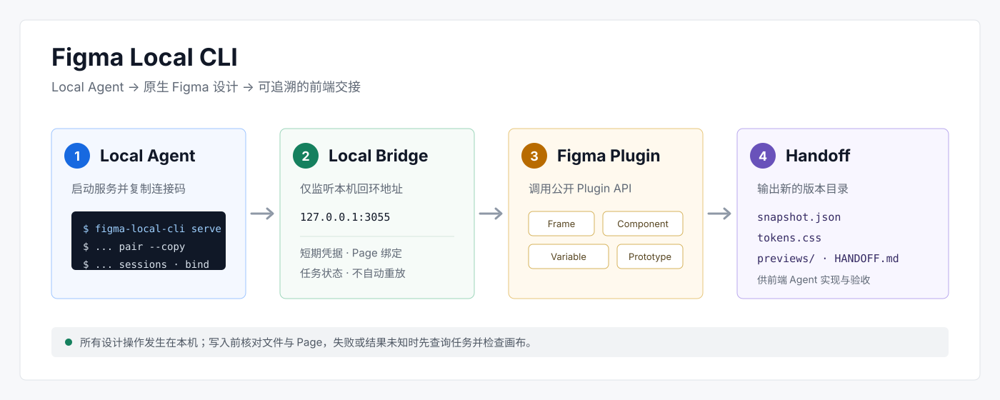
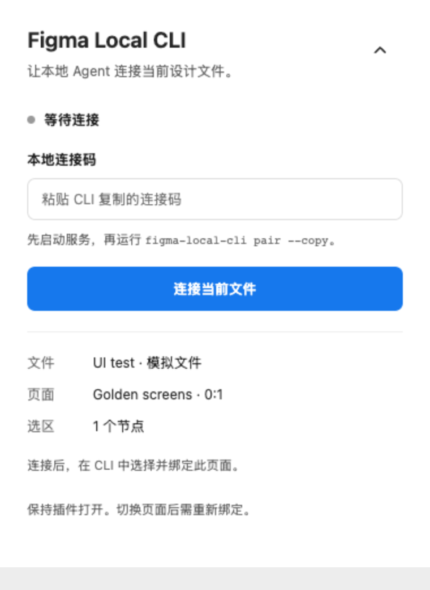
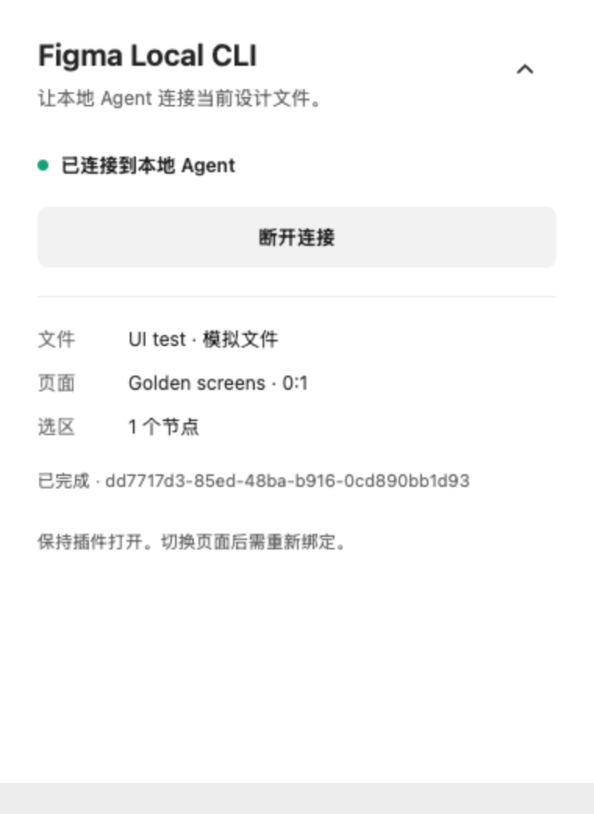
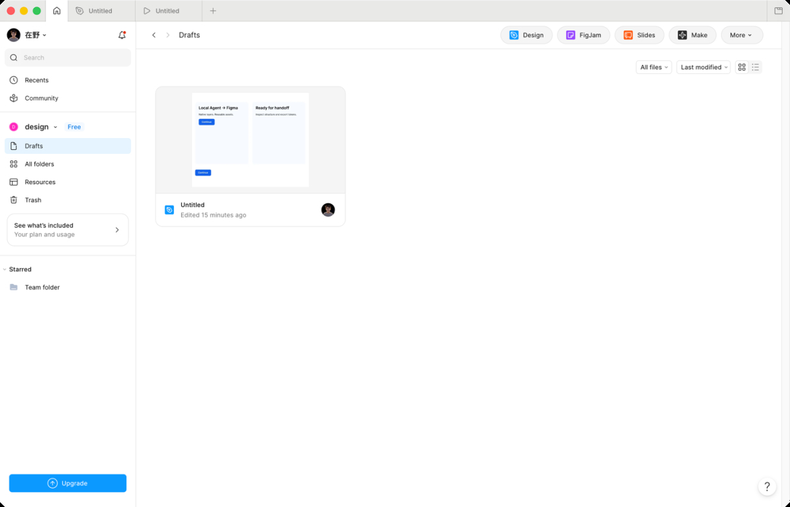
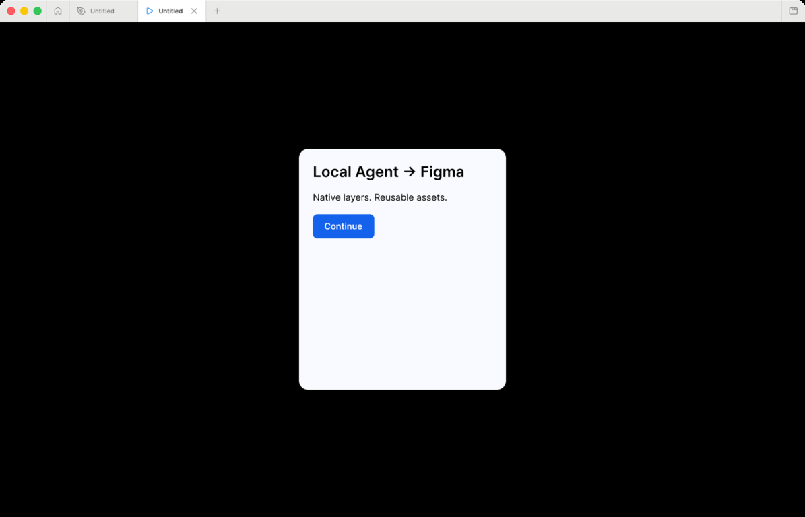
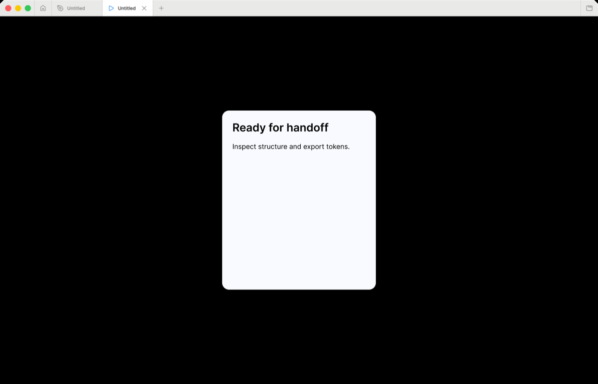
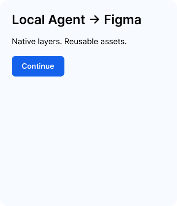
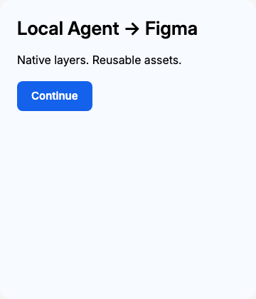
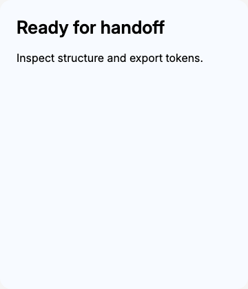

# Figma Local CLI

让本地 Agent 通过 Figma 开发插件操作当前文件，并把页面结构、变量、组件资料和预览交给前端 Agent。

<p align="center">
  
</p>

**适用：macOS + Node.js 22+ + Figma 桌面端 + 有编辑权限的个人草稿。主路径不需要 PAT，不调用官方 MCP，不消耗 MCP 读取额度。**

当前 Release：**`v0.1.0`**。已在真实 Free 工作区的个人草稿跑通闭环：创建原生页面、组件、实例、变量和可点击原型，读回结构，提取设计资产，再在本地实现并验收前端。当前源码的构建、27 项自动测试和插件模拟 host 浏览器回归均通过。

| 能力 | 说明 |
|---|---|
| 连接 | 本机 HTTP 桥接 + Figma Development Plugin |
| 读取 | Page、Section、Frame、文本、Auto Layout、变量、组件和原型 |
| 写入 | 执行本地可信的异步 Plugin API 脚本 |
| 导出 | PNG、SVG、结构快照、DTCG Token 候选和前端交接包 |
| 安全 | 回环地址、短期凭据、目标绑定、任务状态和写入不自动重放 |

详细依据见 [架构](docs/architecture.md)、[验证记录](docs/verification.md)、[Free 账号项目规范](docs/superpowers/specs/2026-10-04-figma-free-project-convention-design.md)和 [CHANGELOG](CHANGELOG.md)。

## 快速开始

```sh
git clone https://github.com/Zaiye-x/figma-local-cli.git
cd figma-local-cli
npm ci
npm run check
npm run install:global
figma-local-cli serve
```

保持最后一个终端运行。然后在 Figma 桌面端：

1. 打开一个有编辑权限的 Figma Design 文件。
2. 通过 **Plugins → Development → Import plugin from manifest** 导入 `dist/plugin/manifest.json`。
3. 启动 **Figma Local CLI** 插件。
4. 在另一个终端运行 `figma-local-cli pair --copy`。
5. 将剪贴板内容粘贴到插件并连接当前文件。

| 1. 粘贴 CLI 复制的连接码 | 2. 确认插件已连接 |
|---|---|
|  |  |

> 上图来自模拟 Figma host 的插件 UI 回归，用于说明操作位置；真实账号接入证据见下方“第一次真实账号验证”。

连接后执行：

```sh
figma-local-cli sessions
figma-local-cli bind <session-id>
figma-local-cli inspect
```

确认输出中的文件名、Page 名、Page ID 和选区正确后，才执行写入或导出。

## 接入一次

如果已经克隆源码但尚未安装全局命令，在项目目录执行：

```sh
npm ci
npm run check
npm run install:global
figma-local-cli serve
```

保持服务终端运行。在 Figma 桌面端登录自己的账号，打开一个可编辑的 Design 草稿：

1. 在 Plugins → Development → Import plugin from manifest 导入 `dist/plugin/manifest.json`（不同客户端语言/版本菜单名称可能略有不同）。
2. 从 Development 菜单运行 **Figma Local CLI**。
3. 另开终端执行 `figma-local-cli pair --copy`。
4. 把剪贴板里的连接码粘贴到插件，点击“连接当前文件”。
5. 用以下命令列出会话、核对文件与页面后绑定：

```sh
figma-local-cli sessions
figma-local-cli bind <session-id>
figma-local-cli inspect
```

连接码只在本机剪贴板中使用，不要发到聊天或提交到仓库。服务凭据在 `.figma-local/session.json`（0600），目录已忽略；正常退出会删除凭据。插件需要保持打开。页面切换或插件重开后重新绑定；服务重启后重新配对。

`install:global` 注册可在任意目录使用的 `figma-local-cli` 命令，并安装全局 `/figma-local-cli` Skill。全局命令链接到本仓库源码；Skill 的权威源也保存在本仓库，维护方式见 [全局安装与维护](docs/global-installation.md)。

状态目录默认固定为本仓库的 `.figma-local`，所以从其他业务项目运行命令仍能找到同一服务。可用 `--state /绝对路径/.figma-local` 或 `FIGMA_LOCAL_STATE` 显式覆盖。同一时间只启动一个服务。

## 第一次真实账号验证

先核对 `sessions` 中的文件名。示例只新建一个独立 Section、两个 Frame、一个按钮组件及实例、两项变量和点击跳转，不删除已有图层：

<p align="center">
  
</p>

```sh
node src/cli.js eval examples/smoke.js
```

保存返回的节点 ID，在 Figma 里确认可编辑图层和从第一屏到第二屏的原型跳转，然后读取与导出：

```sh
node src/cli.js inspect <section-id> --depth 10
node src/cli.js screenshot <first-frame-id> --out artifacts/first-frame.png
node src/cli.js handoff --out artifacts/smoke-handoff
```

示例会选中两屏和按钮组件，因此无参数 `handoff` 会读取这些选区。对照 `snapshot.json` 中的 `INSTANCE`、`mainComponent`、`boundVariables` 和 `reactions`，确认导出是原生结构。只有这一步在真实 Figma 成功，才能认定这个账号已接通。示例不是业务产品设计。

| Prototype 起点 | 点击后的完成态 |
|---|---|
|  |  |

`eval` 的输入是**异步函数体**，可以使用 `figma`、`context`、`await` 和 `return`；不支持 Node 的文件/网络模块、`import` 或 `require`：

```js
await figma.loadFontAsync({ family: 'Inter', style: 'Regular' });
const frame = figma.createFrame();
frame.name = 'Approved screen';
frame.layoutMode = 'VERTICAL';
frame.resize(480, 320);
return { id: frame.id };
```

脚本是本地可信代码，拥有公开 Plugin API 的权限，不是只读沙箱。开始执行前复核绑定页面，但脚本仍能访问其他页面；长脚本中不要手动切页。失败或超时可能留下局部修改，没有自动事务回滚。无限循环会阻塞插件，应拆成小任务。

## 从设计到前端

建议按“目标与用户旅程 → 页面/状态 → 认可代表页面 → 提取资产 → 语义命名与代码映射 → 前端实现 → 浏览器验收”推进。

Free / Starter 账号建议采用固定三 Page 主文件：

```text
00 · Map & Journey
10 · Product & Prototype
90 · System & Specs
```

业务模块和用户流使用 Section，实际页面与状态使用 Frame，正式结构使用 Auto Layout，Group 不作为长期布局边界。完整规范见 [Figma Free Account Project Convention](docs/superpowers/specs/2026-10-04-figma-free-project-convention-design.md)。

### 预览项目骨架

第一阶段的 `scaffold` 只读取当前文件并生成计划，不写入 Figma。先完成 `sessions` 和 `bind`，再运行：

```sh
figma-local-cli scaffold --config examples/figma-project.json
```

配置格式：

```json
{
  "schemaVersion": 1,
  "project": {
    "code": "PRJ",
    "name": "Product Name",
    "version": "v1"
  },
  "pageMode": "three",
  "platforms": ["desktop", "mobile"],
  "flows": [
    { "code": "F01", "name": "Onboarding" },
    { "code": "F02", "name": "Core Task" }
  ]
}
```

计划会列出当前文件、Page、选区、创建/重命名/采用/保留操作、Starter Page 上限、名称冲突和预计 Section 数量。无冲突时 `executable=true`；冲突时仍输出计划，但进程退出码为 `2`。

- 默认只自动采用唯一、空白且名为 `Page 1` 的 Page。
- 非空或无法唯一判断的 Page 必须显式指定 `--adopt-page <page-id>`。
- `--page-mode single` 是显式单 Page 回退，不会在三 Page 失败后自动启用。
- `--apply` 在第一阶段会直接拒绝；真实写入将在独立增量实现。

本次真实 smoke 的前端可以直接查看，或启动本地预览：

```sh
python3 -m http.server 3913 --bind 127.0.0.1 --directory artifacts/real-20261004/frontend
```

打开 `http://127.0.0.1:3913`。复现构建过程见 [前端示例说明](examples/frontend-smoke/README.md)；该示例只实现 `smoke.js` 的两屏流程，不是通用业务代码生成器。

| Figma 原生 Frame | 浏览器起点 | 浏览器完成态 |
|---|---|---|
|  |  |  |

```sh
# 选中已认可的代表页面，或通过 --node 指定根节点
node src/cli.js extract --node <frame-id> --out design-assets/v1
node src/cli.js handoff --out design-assets/v2 --depth 10 --max-previews 6

# 单独导出图标/矢量节点
node src/cli.js screenshot <node-id> --format SVG --out design-assets/icon.svg
```

输出目录必须不存在，防止覆盖手工补充的规范。先将新版本导出到新目录，再评审差异。

| 文件 | 用途 |
|---|---|
| `snapshot.json` | 来源、范围、截断状态、节点结构、Auto Layout、文本分段、变量、样式、组件和原型 |
| `tokens/*.tokens.json` | 按 collection / mode 导出的 DTCG 2025.10 子集 |
| `tokens.css` | 各 collection 默认模式的 CSS 自定义属性，保留别名 |
| `token-index.json` | token 与原始变量、模式、CSS 名称的映射 |
| `candidates.json` | 未显式绑定值的频次和节点来源，需设计评审 |
| `component-map.json` | 组件与实例来源，代码映射初始为 `unmapped` |
| `design.md` | 提取摘要与需要确认的规范 |
| `HANDOFF.md` | 前端 Agent 入口与验收要求 |
| `previews/` | `handoff` 生成的实际节点 PNG 和来源索引 |

token 路径包含 collection、mode 和 variable 标识，避免合并不同模式时混淆别名；原名完整保留在索引。跨 collection 别名指向目标 collection 的默认模式，依赖记录在 `$extensions.figma-local.dependencyModes` 中。这里没有自动解析某个页面的全部主题覆盖；节点的 `explicitVariableModes` / `resolvedVariableModes` 保存在快照供后续判断。

`COLOR` 使用标准 sRGB 对象和透明度；`FLOAT` 默认保留为 `number`，不会猜成 px。若确认某 token 是间距，CSS 可以写 `padding: calc(var(--对应变量名) * 1px)`。通用 `STRING/BOOLEAN` 原样保留，不冒充标准 token 类型。未提取的外部变量引用、别名循环、缺失模式或无效类型会使提取报错；可先用 `inspect` 留存结构，再补齐变量依赖。样式保存在快照，第一版不自动把文本/阴影样式编译成复合 token。

组件资料范围是选定子树及实例主组件引用；变量和样式范围是整个文件的本地资产。快照不是 `.fig` 完整备份，PNG 不是可复用组件；复杂资源可另用 `screenshot --format SVG` 或受控脚本导出。

前端 Agent 可以直接收到这样的任务：

> 阅读 design-assets/v2/HANDOFF.md 和关联资料，先核对截断与认可状态，复用 tokens.css 和已映射组件，按 Auto Layout 与文本样式实现页面。补齐响应式、空态、错误态、加载态与键盘交互。运行本地页面并截图对照，记录偏差后迭代。

## 命令

运行 `figma-local-cli help` 查看完整参数。未安装全局命令时仍可使用 `node src/cli.js`。

| 命令 | 行为 |
|---|---|
| `serve` / `pair --copy` / `doctor` | 启动、配对、检查环境 |
| `sessions` / `bind ID` | 核对并绑定目标文件页面 |
| `inspect [ID]` | 有深度/数量预算的结构读取；默认选区，否则当前页 |
| `scaffold --config FILE` | 只读当前文件并生成项目骨架计划；第一阶段不写入 |
| `eval FILE` | 执行本地异步 Plugin API 脚本 |
| `screenshot ID --out FILE` | PNG / SVG 导出；PNG 可设 `--scale` |
| `extract --out DIR` | 导出候选资产 |
| `handoff --out DIR` | 导出资产并附选区/顶层画框预览 |
| `job ID` | 查询结果，不重新执行 |

默认节点预算 2000 / 深度 8；最大 10000 / 30。`completeness.truncated=true` 时通过 `--node` 分块读取。默认任务执行超时 60 秒，`--timeout` 最多 300 秒；排队超时 20 秒。

任务状态：`queued → running → succeeded / failed / indeterminate`。任务 ID 在提交前写入 stderr，数据结果写 stdout，可供 Agent 解析。超时后先 `job ID`；迟到的回包保存在 `lateResult`，主状态保持 `indeterminate`，提醒曾发生不确定执行。插件一次只执行一项任务，写任务不会自动重试。任务只保存在服务内存中，重启前保存需要的结果。

## 排错

| 现象 | 处理 |
|---|---|
| 没有会话 / 服务不可达 | 在同一目录 `npm start`；检查 `--state` 是否一致 |
| 插件连不上 | 确认使用桌面端开发插件、服务端口3055和最新连接码；检查 manifest 的开发网络权限 |
| 401 / 服务重启 | 重新 `pair --copy` |
| `Origin rejected` | 查看插件控制台的实际 Origin；核实来自 Figma 后调整精确白名单，不改成 `*` |
| 页面变更 / 插件重启 | 重新 `sessions`、核对、`bind` |
| 任务超时 | 先 `job ID` 并检查 Figma；未确认前不要再执行同一写脚本 |
| 字体不可用 | 用 `figma.listAvailableFontsAsync()` 查可用字体，设置文本前 `loadFontAsync` |
| 变量别名依赖未提取 | 外部库变量需要导入文件内或另行解析；第一版不自动复制团队库 |
| 预览缺失 | 检查选区类型；`handoff` 只导出前 N 个选定/顶层 Frame、Component、Instance、Section |

## 开发与测试

```sh
npm run check
```

UI 测试使用 Python Playwright 和本机 Chromium，需要同时运行服务和静态测试 host：

```sh
# 终端1
npm start
# 终端2
python3 -m http.server 3912 --bind 127.0.0.1
# 终端3（在已安装 playwright 的 Python 环境）
python3 test/ui_smoke.py
```

已安装的浏览器不在 Playwright 默认路径时，可设置 `PLAYWRIGHT_CHROMIUM_EXECUTABLE=/浏览器可执行文件路径`。测试会使用 `.figma-local` 的当前服务并绑定模拟会话，**请在独立测试服务中执行**；结束后关闭服务，真实使用前重新启动和配对。

源码：`src/` 为 CLI/服务/导出，`plugin/` 为 Figma 主线程与 UI，`examples/` 为真实接入样例。没有云端账号服务、付费库发布或官方 Code Connect。详细范围见 [架构](docs/architecture.md)。

## 发布版本

| 版本 | 日期 | 状态 |
|---|---|---|
| `v0.1.0` | 2026-10-04 | 首个可用版本；真实 Free Draft 读写与交接闭环通过 |

版本号以 `package.json`、Git tag 和 GitHub Release 为准。变更记录见 [CHANGELOG.md](CHANGELOG.md)。
