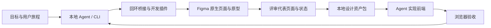

# Figma 免费个人账号与本地 Agent 工作流可行性调研

调研日期：**2026-10-04**。适用环境：macOS、本地可运行命令的 Agent、Figma Starter、自有且可编辑的 Design 文件。

## 摘要

**用户提出的闭环可行，推荐以“本地 CLI → 本地桥接 → Figma 开发插件 → 官方 Plugin API”为主通道。** Agent 负责设计决策和操作脚本；Figma 提供可编辑的画布、组件和原型；本地目录保存规范、设计 token、截图与组件映射，并供前端 Agent 消费。

“连接个人账号”在这个方案里是：用户在 Figma 桌面端正常登录，插件在该用户有权限的当前文件中运行。CLI 不登录账号，不获取密码或浏览器 Cookie，不需要 Figma PAT。它也不能在关闭 Figma 后无人值守地操作任意云端文件。

**免费版足以做个人项目页面、文件内组件与基础原型，不能等价获得付费团队库、Dev Mode、Code Connect 或 Enterprise Variables REST API。** 自动提取出的设计数值还需要设计判断才能成为语义规范。现已在用户真实 Free 工作区的草稿中完成创建、读回、原型点击、资产导出和前端浏览器验证，详见[实测记录](verification.md)。

## 1. 研究范围与证据

方法采用能力对标和用户旅程分析。证据来自用户指定文章、官方套餐和开发者文档、两个开源项目的一手 README。能力和额度快速变化，本文不将当前 beta、客户端白名单或未来价格作永久承诺。

| 证据层 | 本次获取内容 | 能证明什么 |
|---|---|---|
| 官方产品文档 | Starter、MCP 配额、Code to canvas、Agent beta、Code Connect | 当前公开套餐和入口边界 |
| 官方 Plugin API | 变量、组件、原型、manifest、fileKey | 合法的可编程接口和实现约束 |
| 社区实现 | 用户文章、Figma Console MCP、Talk to Figma MCP | 同架构已有实践，不能替代自身实测 |
| 本地与真实环境 | Node 24.20.0 / npm 11.19.0；Figma 桌面端 Free 工作区 | 插件已导入配对；原生节点、变量、组件和基础原型实测成功 |

## 2. 免费账号能力边界

| 能力 | Starter 下的判断 | 对本方案的影响 |
|---|---|---|
| 自有草稿 | 官方说明草稿数量不限；免费草稿邀请他人仅能查看 | 个人项目优先使用自己的草稿 |
| 团队文件 / 页面 | 单文件夹，Design 与 Sites 合计 3 个文件；Starter 团队 Design 文件最多 3 页 | 页面内用多个 Frame/Section 组织，避免按屏幕新建 Page |
| 官方远程 MCP 读取 | Starter **最多 6 次/月**；受限工具以读取类为主 | 不作为高频读取通道 |
| 官方桌面 MCP | Dev/Full seat 的付费套餐；Starter 无 Dev Mode | 不能把安装桌面端等同于拥有官方桌面 MCP |
| `use_figma` 自由写画布 | 专门文档要求 Full seat，修改已有文件还需编辑权限 | 不把它当作免费个人方案的必要条件 |
| `generate_figma_design` | 专门文档：任何席位可在自己的 Drafts 创建或编辑；写入非草稿需 Full seat 和编辑权限 | 可选“代码网页回到 Figma”入口；依赖支持的客户端和远程 MCP |
| 本地开发插件 | Plugin API 提供当前文件原生图层、组件、变量、导出等接口 | 核心路径，不消耗官方 MCP 读取调用 |
| 文件内变量 / 组件 / 样式 | 可通过 Plugin API 创建和读取；仍遵守文件权限和功能套餐 | 免费资产沉淀以文件内复用为主 |
| 变量多模式 | 官方模式说明列出 Education / Professional / Organization / Enterprise | 不承诺 Starter 原生多主题模式；本地 token 可先存多套 |
| 团队库 | Starter overview 明确不提供 team libraries | 跨项目先用模板副本、脚本和版本化本地资产 |
| Variables REST API | Enterprise 要求，成员/席位/读写条件另有限制 | 不使用该 API 作为免费方案的变量来源 |
| Code Connect | Organization / Enterprise 的 Dev 或 Full seat | 本地 `component-map.json` 作为交接资料，不能称为官方已连接 |
| 基础原型 | 任意套餐有编辑权即可建原型；Plugin API 有 reactions | 先覆盖点击、返回和页面跳转；高级条件/变量行为逐项实测 |

来源：[Starter][2]、[页面][3]、[MCP 配额][4]、[MCP 指南][5]、[Write to canvas][6]、[Code to canvas][7]、[变量模式][8]、[Variables REST][9]、[Code Connect][10]。

这里的关键不是寻找一个万能的 Figma 登录接口，而是把“账号”“文件权限”“接入 API”和“产品套餐”分开。用户拥有个人文件编辑权，插件就可以在被打开的文件里执行常规设计操作；同一账号不因此拥有所有 REST API 或团队协作功能。开发插件没有替用户升级套餐，也不需要伪装为官方 MCP。对个人项目，这种边界是可接受的：设计、查看和迭代本来就在桌面端进行，打开一次文件并保持插件运行可以换来连续的 Agent 操作。真正受影响的是多文件后台批处理、团队分发和官方开发交接。因而资产必须同时落在本地版本化文件中，避免全部寄托在免费套餐不提供的团队库上。

## 3. 对用户文章的核验

| 文章论断 | 核验结果 | 修正或条件 |
|---|---|---|
| CLI + 桥接 + 插件可产生可编辑图层 | API、开源实现与本次真实草稿实测均支持 | 已验证 Inter、两屏与截图；其他字体、复杂页面仍按目标测试 |
| 创建组件、自动布局、原型跳转 | 官方 API 支持 | `dynamic-page` 模式使用异步 API，原型使用 `setReactionsAsync` |
| 官方 MCP 写入需要付费席位 | 对自由写入的 `use_figma` 有 Full seat 要求 | **不能推广到所有写入工具**；Code to canvas 对自己的草稿有免费可用路径 |
| 官方 MCP 当前不支持自定义字体/图片 | 专门的 Write to canvas 文档确实列出限制 | 总览文档又提到可用上传字体，存在范围/更新差异；按具体工具实测 |
| 本地插件可操作图片、字体 | `createImage`、图片字节、字体加载等官方 API 支持 | 素材需自行合法提供；字体必须在客户端可用且先 `loadFontAsync` |
| 本地回环、临时 token、确认 ok | 是合理的工程实践 | 还需要实例绑定、目标页面复核、任务超时和不自动重放写操作 |
| 这样就不需要设计师 | 属于作者的个人体验 | 工具不保证审美、信息架构、无障碍、响应式和业务设计正确 |

文章发布时间为 2026-09-09；本次核对为 2026-10-04。[1] 文档变化已经足以改变部分选型建议：官方远程 MCP 不只有一种写入能力，Code to canvas 可以成为免费账号的辅助入口，Figma 自身 Agent 也已向 Starter 等套餐逐步开放 beta。与此同时，免费读取配额依然无法支持大量迭代。对本地 Agent 的核心需求，文章的桥接思路依旧有价值，价值在于控制操作和资产格式，而不是笼统地“官方收费，所以只能自建”。实现应保持原生 Figma 节点和明确执行结果；截图只能验证视觉，结构读回才能验证是否真的生成组件、实例、变量绑定和原型。两种验证需要并行存在。

## 4. 产品与技术路线对比

| 路线 | 优点 | 代价 / 约束 | 本次定位 |
|---|---|---|---|
| 官方远程 MCP | 官方维护；结构读取、写画布、网页捕获工具 | 读取额度、Full seat 要求、支持客户端白名单，工具资格需分别判断 | 可选补充 |
| Figma Agent beta | 直接在设计界面对话；beta 不消耗 AI credits | 按团队逐步开放，月容量限制；不是用户指定的本地 Agent | 可用于探索设计 |
| Figma Console MCP | MIT；插件桥接；现有变量、设计系统提取和设计写入工具丰富 | 是 MCP 工具栈；README 入门含 PAT，部分读取/历史依赖 REST；需逐工具核实 | 若更看重现成能力，是首要备选 |
| Talk to Figma MCP | MIT；WebSocket + 插件；节点、文本、自动布局等操作 | Bun / MCP / channel；项目化资产约定需补齐 | 简单连接和基础操作备选 |
| 自建轻量 CLI + 插件 | 任意可运行 shell 的 Agent 均可用；主路径无 PAT；可定制交接包 | 自己维护协议、序列化、错误处理；没有成熟产品的全面能力 | **本次采用** |

[Figma Console MCP][15] 的 README 在查询时标注 v1.40.9（2026-10-02），并描述 DTCG 2025.10 token 往返和 codebase 设计系统提取；这些是项目声明，本次没有安装并逐一运行验证。避免用工具数量评判适合程度：同名“读取”可能走不同接口，默认配置中有 PAT 不代表所有插件方法都依赖 PAT，更不代表所有方法都能在 Starter 上运行。用户明确要掌握 CLI 能力，且现有目录为空，适合先建立一个边界清晰、能验证结果、能把资产交给任意 Agent 的小内核。将来若转用成熟 MCP，节点快照、token 与组件映射依然可复用。

## 5. 用户旅程与资产闭环

| 阶段 | 用户 / Agent 动作 | 保存的资料 | 通过标准 |
|---|---|---|---|
| 接入 | 正常登录 Figma；打开自有草稿；启动插件并配对 | 仅本地会话信息 | CLI 读回真实文件名、页面与选区 |
| 设计 | 从目标与旅程生成原生 Frame、Auto Layout、组件与基础跳转 | 操作脚本、节点 ID、PNG | 可编辑；关键跳转可点；没有溢出或缺字 |
| 评审 | 用户确定核心界面、空态、错误态、加载态与移动布局 | 被认可的 frame 清单和截图 | 不从一张偶然生成的页面推导完整规范 |
| 提炼 | 提取变量、样式、结构、组件/实例、绑定和使用频次 | 快照、DTCG token、候选统计 | 保留来源和模式；原始值与语义判断分开 |
| 沉淀 | 确认 foundation / semantic / component token 与代码映射 | `design.md`、`component-map.json`、组件代码 | 命名、状态、用途和例外清楚 |
| 开发 | Agent 阅读交接包并复用代码组件 | 产品源码和验证结果 | 响应式、键盘、状态和交互符合设计 |

Figma 负责经认可的页面组合和视觉意图；DTCG 文件负责跨工具的数值规范；代码组件负责 API、状态和运行行为；映射文件负责两者关联。一次提取会告诉我们“这里用了 16px”和“哪些节点引用它”，不能自动判断 16px 应该是卡片内边距、全局间距还是一次性例外。第一版应将数值统计标为候选，把现有命名变量当作已经存在的显式设计信息，同时保留出处。修改进入下一轮时先判明改变的是页面意图、token 还是代码行为，再更新相应资料；不把任意两边的最后保存版本相互覆盖。这样资产能够稳定积累，也保留用户手动修改 Figma 的权利。

## 6. 实现约束与验收

| 项目 | 采用方式 | 明确边界 |
|---|---|---|
| 传输 | 仅 `127.0.0.1`，HTTP 轮询，临时会话密钥 | Figma 和插件必须打开 |
| 身份与目标 | 配对后的插件会话 ID + page ID；写操作前在插件再次核对 | 普通插件的 `figma.fileKey` 不保证可用；不使用私有 API 冒充文件身份 |
| 写入 | 本地脚本通过 Plugin API 执行；一次只运行一个任务 | 没有通用事务回滚；失败可能有部分修改；不自动重试写脚本 |
| 结果 | queued / running / succeeded / failed / indeterminate | 超时不等于成功，也不等于未执行 |
| 读取 | 指定节点、有限深度和数量，完整性标记 | 大页面分块；不可静默截断后当完整设计 |
| token | DTCG 2025.10 支持的类型和别名；原始变量另存 | 不把所有 FLOAT 自动加 px；未知字符串/布尔保留原始信息 |
| 组件 | 组件、变体、实例引用和映射资料 | 本地映射不等同官方 Code Connect 发布 |
| 前端 | 输出结构、截图、CSS 和交接说明供 Agent 开发 | 不声称 Figma 图层能自动推出生产业务逻辑 |

本次分三层完成验证：静态类型和构建；本地桥接与模拟插件协议；真实桌面端 smoke。真实工作区 UI 显示 Free，独立草稿中创建了两屏、一个按钮组件及实例、两项变量和点击跳转。提取包含 10 个节点、2 个变量、1 个组件、3 张 PNG，无截断或警告。随后从该包实现本地前端，并完成点击、键盘、历史返回和窄屏验收。验证范围是这条小型真实流程，不能将其推广为所有套餐受限 API 或任意复杂产品均已验证。

实测还发现了两个客户端兼容点：开发 manifest 必须使用 `http://localhost:3055`，当前客户端拒绝 IP 字面量；插件 UI 需接受嵌套 sandbox 中外层 Figma 官方宿主发来的消息。修复后真实操作和对应浏览器回归均通过。

## 7. 结论

免费个人账号可以承担页面设计和文件内设计资产的主要工作。本地 Agent 通过开发插件操作官方 Plugin API，是与用户目标匹配的实现路径。官方 MCP 的免费草稿捕获和 Figma Agent beta 是补充选项，团队库、Code Connect、复杂模式和后台文件操作则需要分别考虑产品权限与长期成本。

本次方案的交付价值是一个可以独立运行、明确报告结果、保留设计来源的连接与交接工具。它是否已经连接成功，以真实账号中的插件执行证据为准；它是否形成高质量设计系统，以被认可的代表页面、语义规范和前端验收为准。

实现补充：本次已在项目内落地 `figma-local-cli` CLI、回环桥接、Figma 开发插件、设计资产提取与 Agent 交接命令。构建、自动测试、模拟 host 浏览器验收、真实免费工作区 smoke 与基于真实交接包的前端验收均通过。[使用说明](../README.md)包含日常操作，[验证记录](verification.md)保存节点、任务 ID、截图和验证边界。具体业务产品的用户旅程与正式设计需在提供需求后另行展开。

## 8. 参考文献

[1] Denkisan. Vibe Design 时代来了：无需付费使用 Figma 做 UI[EB/OL]. (2026-09-09)[2026-10-04]. https://denkisan.me/articles/agent-figma-ui-prototyping/

[2] Figma. Starter plan overview[EB/OL]. [2026-10-04]. https://help.figma.com/hc/en-us/articles/13838684089751-Guide-to-the-Starter-plan

[3] Figma. Create and manage pages[EB/OL]. [2026-10-04]. https://help.figma.com/hc/en-us/articles/360038511293-Create-and-manage-pages

[4] Figma. Plans, access, and permissions[EB/OL]. [2026-10-04]. https://developers.figma.com/docs/figma-mcp-server/plans-access-and-permissions/

[5] Figma. Guide to the Figma MCP server[EB/OL]. [2026-10-04]. https://help.figma.com/hc/en-us/articles/32132100833559-Guide-to-the-Figma-MCP-server

[6] Figma. Write to canvas[EB/OL]. [2026-10-04]. https://developers.figma.com/docs/figma-mcp-server/write-to-canvas/

[7] Figma. Code to canvas[EB/OL]. [2026-10-04]. https://developers.figma.com/docs/figma-mcp-server/code-to-canvas/

[8] Figma. Modes for variables[EB/OL]. [2026-10-04]. https://help.figma.com/hc/en-us/articles/15343816063383-Modes-for-variables

[9] Figma. Variables REST API[EB/OL]. [2026-10-04]. https://developers.figma.com/docs/rest-api/variables/

[10] Figma. Code Connect introduction[EB/OL]. [2026-10-04]. https://developers.figma.com/docs/code-connect/

[11] Figma. Plugin Quickstart Guide[EB/OL]. [2026-10-04]. https://developers.figma.com/docs/plugins/plugin-quickstart-guide/

[12] Figma. Plugin Manifest[EB/OL]. [2026-10-04]. https://developers.figma.com/docs/plugins/manifest/

[13] Figma. figma.variables; figma; reactions[EB/OL]. [2026-10-04]. https://developers.figma.com/docs/plugins/api/figma-variables/ ; https://developers.figma.com/docs/plugins/api/figma/ ; https://developers.figma.com/docs/plugins/api/properties/nodes-reactions/

[14] Figma. AI agent beta in Figma Design[EB/OL]. [2026-10-04]. https://help.figma.com/hc/en-us/articles/34932042346775-How-do-I-access-the-AI-agent-beta-in-Figma-Design

[15] Southleft. Figma Console MCP README[CP/OL]. [2026-10-04]. https://github.com/southleft/figma-console-mcp

[16] Sonny Lazuardi. Talk to Figma MCP README[CP/OL]. [2026-10-04]. https://github.com/sonnylazuardi/cursor-talk-to-figma-mcp

[17] Design Tokens Community Group. Design Tokens Format Module 2025.10[EB/OL]. (2025-10-28)[2026-10-04]. https://www.designtokens.org/tr/2025.10/format/

[2]: https://help.figma.com/hc/en-us/articles/13838684089751-Guide-to-the-Starter-plan
[3]: https://help.figma.com/hc/en-us/articles/360038511293-Create-and-manage-pages
[4]: https://developers.figma.com/docs/figma-mcp-server/plans-access-and-permissions/
[5]: https://help.figma.com/hc/en-us/articles/32132100833559-Guide-to-the-Figma-MCP-server
[6]: https://developers.figma.com/docs/figma-mcp-server/write-to-canvas/
[7]: https://developers.figma.com/docs/figma-mcp-server/code-to-canvas/
[8]: https://help.figma.com/hc/en-us/articles/15343816063383-Modes-for-variables
[9]: https://developers.figma.com/docs/rest-api/variables/
[10]: https://developers.figma.com/docs/code-connect/
[15]: https://github.com/southleft/figma-console-mcp
